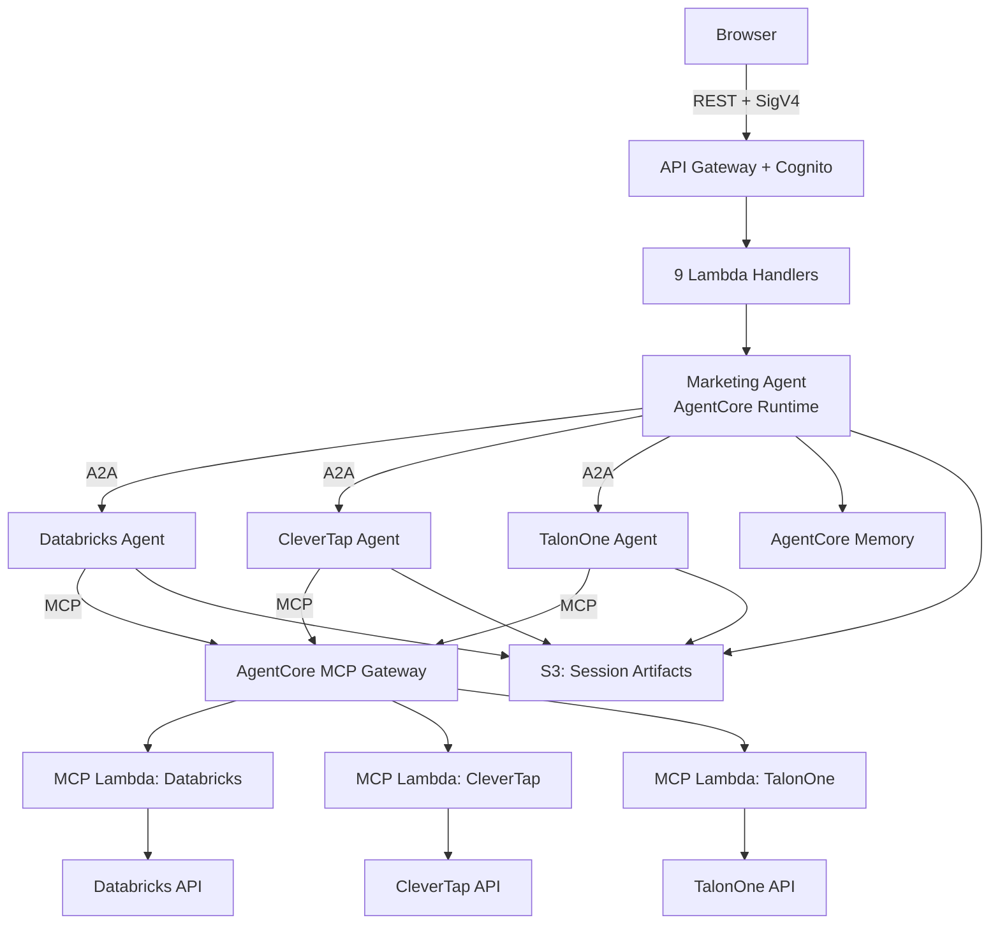

# Architecture Overview

## System Architecture

The MarTech platform follows a layered architecture where four specialized AI agents interact with marketing platforms through a unified orchestration layer.

## Agent Topology

| Agent | Role | Key Capabilities | Runtime |
|-------|------|-----------------|---------|
| **Marketing Agent** | Orchestrator — enforces 3-step workflow, collects user confirmations | A2A delegation, SSE streaming, S3 artifact hooks, AgentCore Memory | Custom FastAPI + Strands |
| **Databricks Agent** | Data analytics and audience segmentation | 8 MCP tools (SQL, Unity Catalog, Jobs) | A2A Server (Strands) |
| **CleverTap Agent** | Campaign lifecycle management | 6 MCP tools (draft, confirm, list, update, discard) | A2A Server (Strands) |
| **TalonOne Agent** | Promotions, coupons, loyalty | 11 MCP tools (campaigns, coupons, loyalty, sessions) | A2A Server (Strands) |

## Technology Stack

## Infrastructure Layer (AWS CDK)

The entire stack is provisioned via AWS CDK in a single CloudFormation stack with 7 constructs:

| Construct | Resources | Purpose |
|-----------|-----------|---------|
| **UserIdentity** | Cognito User Pool + Identity Pool | OIDC authentication with SigV4 credential exchange |
| **StorageAndData** | DynamoDB table (Campaigns) + 3 S3 buckets | Campaign storage, session artifacts, SQL results, access logs |
| **GatewayConstruct** | AgentCore MCP Gateway + 3 Lambda targets | Routes tool calls with IAM auth; 8+6+11 tools across 3 targets |
| **AgentConstruct** | 4 AgentCore Runtimes + shared Memory | Hosts all agents with IAM roles for Bedrock, SSM, and gateway access |
| **APIConstruct** | API Gateway + 9 Lambda handlers | REST endpoints for campaigns, chat, configuration, SQL results |
| **WebUi** | S3 + CloudFront | Static site hosting for the React/Cloudscape frontend |
| **SeedConfig** | SSM Parameter Store entries | Default model IDs and system prompts for all 4 agents |

## How the Agents Connect

Two communication patterns connect the four agents:




Each platform agent (Databricks, CleverTap, TalonOne) accesses its tools via the **AgentCore MCP Gateway**. The gateway:

- Authenticates calls with **IAM SigV4** — no API keys to manage
- Routes to the correct **Lambda-based MCP server** based on tool name
- Filters tools by prefix (`databricks-target___execute_sql` → `execute_sql`)
- Isolates agent logic from infrastructure changes — update a Lambda without touching agent code

Credentials for each third-party platform are stored in **AWS Secrets Manager** and injected into the Lambda execution environment.



The **Marketing Agent** communicates with platform agents via **A2A**, treating each sub-agent as a remote tool. A2A provides:

- **SigV4-authenticated streaming** via SSE events (4 event types: text, tool_use, tool_result, subagent_progress)
- **Session ID propagation** — the same session flows through all agents, enabling unified S3 artifact storage and AgentCore Memory context
- **Progress reporting** — intermediate updates from worker agents stream back to the UI in real-time
- **IAM access control** — the Marketing Agent's execution role explicitly grants `InvokeAgentRuntime` and `GetAgentCard` for each worker agent




## Data Flow

When a marketer describes a campaign goal in the chat UI:

1. The **Web UI** sends the prompt to the API Gateway via a SigV4-signed PUT request
2. The **Put Chat Lambda** invokes the Marketing Agent on AgentCore Runtime with a session ID
3. The **Marketing Agent** follows its 3-step system prompt, delegating to worker agents via A2A
4. Each **worker agent** calls tools through the MCP Gateway, which routes to the appropriate Lambda
5. The **MCP Lambda** translates the tool call into the platform's native API, retrieves credentials from Secrets Manager, and returns results
6. Results flow back through A2A streaming events to the Marketing Agent
7. The Marketing Agent **streams SSE events** back through the Lambda to the Web UI in real-time
8. All agents write their conversation messages to **S3** via the `S3ArtifactHook` for audit and inspection
