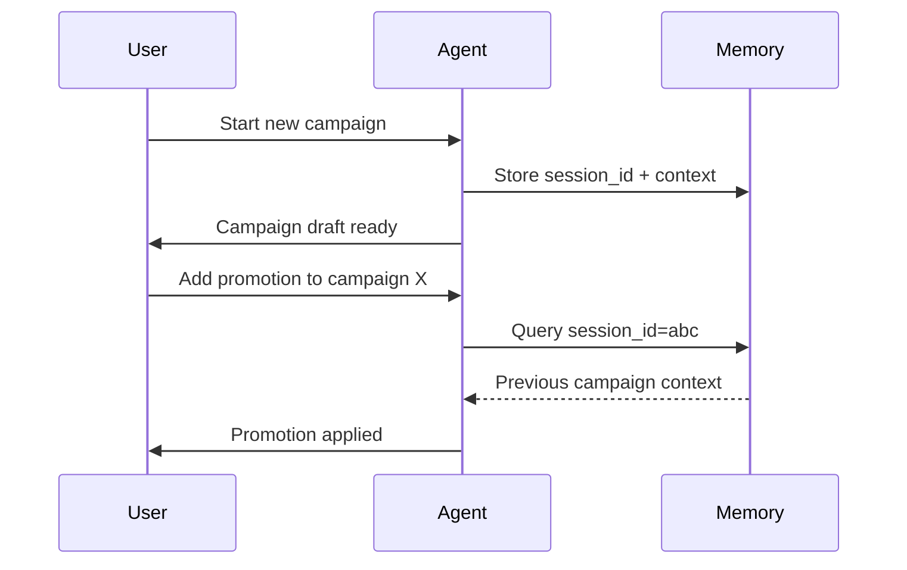
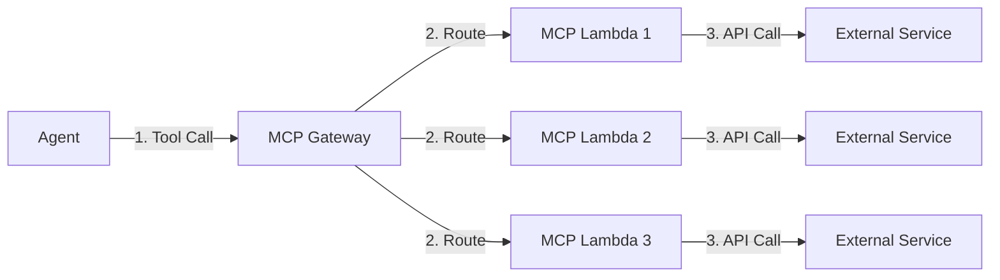

# AWS AgentCore Services

AWS AgentCore is the managed service backbone powering the entire multi-agent system. It provides three core capabilities that eliminate the undifferentiated heavy lifting of building production AI agent infrastructure.

---

## AgentCore Runtime

**What it is**: A serverless container runtime that hosts AI agents. You provide a Docker image, and AWS handles deployment, scaling, health checks, and observability.

**Key features**:
- HTTPS connectivity secured with **SigV4** (no API keys needed)
- Automatic scaling based on request volume
- Built-in logging, tracing, and metrics
- Native integration with Bedrock model providers

{}
Using SigV4 authentication instead of API keys means your agents never need to manage or rotate credentials manually — IAM handles it automatically.
{}

---

## AgentCore Memory

**What it is**: A persistent memory layer that retains conversation context across multiple turns and sessions.

**How it works**:



**Key features**:
- Session ID and prompt ID tracking
- Cross-conversation context retrieval (backtrack into previous conversations)
- Automatic state persistence between tool calls and agent invocations

{}
AgentCore Memory lets agents recall prior interactions in long-running workflows — critical when a marketer iterates on a campaign over multiple messages.
{}

---

## AgentCore MCP Gateway

**What it is**: A managed gateway that routes tool calls from agents to Lambda-based MCP (Model Context Protocol) servers, acting as an intermediary for tool management.

**How it works**:



**Key features**:
- Centralized management of all MCP servers in your AWS account
- **IAM SigV4 authentication** between agents and the gateway
- Infrastructure decoupling: update Lambda implementations without touching agent logic
- Automatic routing based on tool name

{}
Without the MCP Gateway, every time you need to modify an MCP tool's infrastructure or Lambda code, you'd have to redeploy the agent as well. The gateway decouples these concerns.
{}

### MCP Client Pattern

Agents use the Gateway MCP Client to access tools:

```python
from bedrock_agentcore.mcp import get_gateway_mcp_client

mcp_client = get_gateway_mcp_client("talonone-mcp-tools")
```

The client returns an MCP toolset that the agent can use just like any other tool, while the gateway handles authentication and routing transparently.

---

## How They Work Together

| Layer | Service | Role |
|-------|---------|------|
| Hosting | AgentCore Runtime | Runs the agent Docker image |
| Memory | AgentCore Memory | Persists conversation context across sessions |
| Tools | AgentCore MCP Gateway | Routes tool calls to Lambda-based MCP servers |

This separation allows each layer to evolve independently — agents, memory, and tools all have distinct lifecycles.
