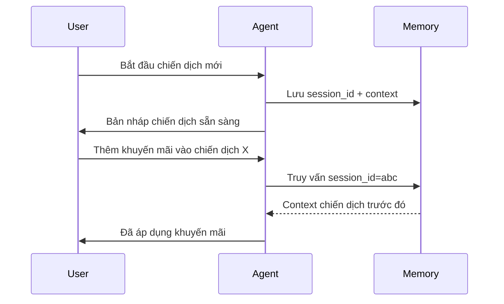
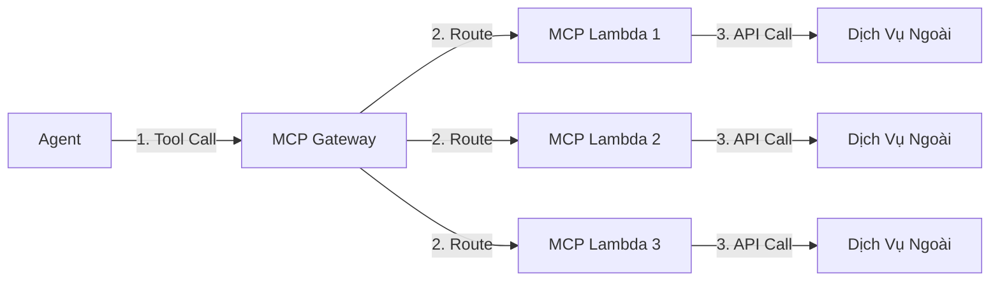

# Dịch Vụ AWS AgentCore

AWS AgentCore là xương sống dịch vụ quản lý cho toàn bộ hệ thống multi-agent. Nó cung cấp ba khả năng cốt lõi giúp loại bỏ công việc nặng nhọc khi xây dựng hạ tầng AI agent production.

---

## AgentCore Runtime

**Là gì**: Một container runtime serverless để host AI agent. Bạn cung cấp Docker image, AWS xử lý việc triển khai, scaling, health check, và observability.

**Tính năng chính**:
- Kết nối HTTPS bảo mật bằng **SigV4** (không cần API key)
- Tự động scaling theo lưu lượng request
- Logging, tracing, và metrics tích hợp sẵn
- Tích hợp native với các Bedrock model provider

{}
Dùng SigV4 thay vì API key có nghĩa là agent của bạn không bao giờ phải quản lý hoặc xoay vòng credentials thủ công — IAM xử lý tự động.
{}

---

## AgentCore Memory

**Là gì**: Một lớp bộ nhớ liên tục giữ lại ngữ cảnh hội thoại qua nhiều lượt và phiên.

**Cách hoạt động**:



**Tính năng chính**:
- Theo dõi Session ID và Prompt ID
- Truy xuất ngữ cảnh xuyên cuộc hội thoại (quay lại các cuộc trò chuyện trước)
- Tự động lưu trạng thái giữa các tool call và lần gọi agent

{}
AgentCore Memory cho phép agent ghi nhớ các tương tác trước trong workflow dài hạn — rất quan trọng khi marketer điều chỉnh chiến dịch qua nhiều tin nhắn.
{}

---

## AgentCore MCP Gateway

**Là gì**: Một gateway quản lý định tuyến tool call từ agent đến các Lambda-based MCP (Model Context Protocol) server, hoạt động như một trung gian quản lý tool.

**Cách hoạt động**:



**Tính năng chính**:
- Quản lý tập trung tất cả MCP server trong tài khoản AWS
- **Xác thực IAM SigV4** giữa agent và gateway
- Tách biệt hạ tầng: cập nhật Lambda mà không cần động đến logic agent
- Định tuyến tự động dựa trên tên tool

{}
Không có MCP Gateway, mỗi lần bạn cần sửa một MCP tool hoặc code Lambda, bạn phải deploy lại agent. Gateway giải quyết vấn đề này.
{}

### MCP Client Pattern

Agent sử dụng Gateway MCP Client để truy cập tools:

```python
from bedrock_agentcore.mcp import get_gateway_mcp_client

mcp_client = get_gateway_mcp_client("talonone-mcp-tools")
```

Client trả về một MCP toolset mà agent có thể dùng như bất kỳ tool nào khác, trong khi gateway xử lý xác thực và định tuyến một cách trong suốt.

---

## Cách Chúng Hoạt Động Cùng Nhau

| Lớp | Dịch Vụ | Vai Trò |
|-------|---------|------|
| Hosting | AgentCore Runtime | Chạy Docker image của agent |
| Bộ Nhớ | AgentCore Memory | Lưu trữ ngữ cảnh hội thoại xuyên phiên |
| Tools | AgentCore MCP Gateway | Định tuyến tool call đến Lambda-based MCP server |

Sự phân tách này cho phép mỗi lớp phát triển độc lập — agent, memory, và tools đều có lifecycle riêng.
