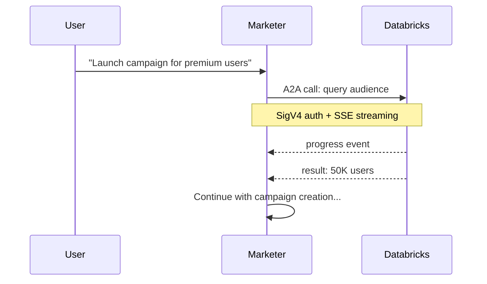

# A2A Agent Communication

## What is A2A?

**A2A (Agent-to-Agent)** is a communication protocol that allows one agent to call another as if it were a local tool. It provides a standardized interface for inter-agent delegation, streaming, and session management.

In the MarTech platform, the **Marketer Agent** (orchestrator) uses A2A to delegate work to the Databricks, CleverTap, and TalonOne agents without needing to know their internal implementation details.

## How A2A Works



**Key characteristics**:

- **Agents as tools**: Each sub-agent is registered as a `@tool` in the orchestrator
- **SigV4 authentication**: All A2A calls use IAM-based authentication
- **SSE event streaming**: Progress updates are sent as Server-Sent Events during execution
- **Session ID propagation**: The same session ID flows through the entire tool call chain

## Implementing A2A

The **Strands Agents** framework provides built-in A2A support. Here is how the Marketer Agent defines its Databricks worker agent as a tool:

```python
from strands_agents.a2a import stream_a2a_agent

def build_databricks_tool(agent_runtime_arn: str, region: str, session_id: str):
    @tool
    async def databricks_agent(request: str) -> AsyncIterator:
        """Send a data analytics request to the Databricks agent.

        Use this tool for any Databricks-related tasks including:
        - Executing SQL queries against Databricks warehouses
        - Discovering schemas, tables, and columns in Unity Catalog
        - Running and monitoring Databricks jobs
        - Audience segmentation and data analysis

        Args:
            request: A natural language description of the data task.
        """
        async for event in stream_a2a_agent(
            agent_runtime_arn,
            region,
            request,
            session_id,
        ):
            yield event

    return databricks_agent
```

{}
The `stream_a2a_agent` function handles the entire A2A handshake — SigV4 signing, connection establishment, and SSE event parsing — so you only need the target agent's ARN and region.
{}

## Benefits of A2A

| Benefit | Description |
|---------|-------------|
| **Decoupling** | Orchestrator agents don't need to know sub-agent internals |
| **Streaming** | Real-time progress updates via SSE keep users informed during long operations |
| **Reusability** | Each agent can be called by multiple orchestrators or workflows |
| **Security** | IAM policies control which agents can call which other agents |
| **Session continuity** | Shared session ID ensures memory and context carry across the chain |
