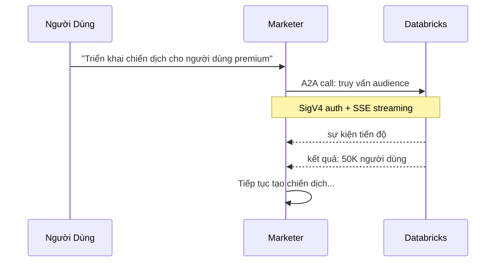

# Giao Tiếp A2A Giữa Agent

## A2A Là Gì?

**A2A (Agent-to-Agent)** là một giao thức giao tiếp cho phép một agent gọi agent khác như thể đó là một local tool. Nó cung cấp interface chuẩn hóa cho việc phân công, streaming, và quản lý phiên giữa các agent.

Trong nền tảng MarTech, **Marketer Agent** (orchestrator) sử dụng A2A để phân công công việc cho Databricks, CleverTap, và TalonOne agent mà không cần biết chi tiết triển khai nội bộ của chúng.

## Cách A2A Hoạt Động



**Đặc điểm chính**:

- **Agent như tool**: Mỗi sub-agent được đăng ký dưới dạng `@tool` trong orchestrator
- **Xác thực SigV4**: Tất cả A2A call sử dụng xác thực IAM
- **SSE event streaming**: Cập nhật tiến độ được gửi dưới dạng Server-Sent Events trong quá trình thực thi
- **Truyền Session ID**: Cùng một session ID chảy qua toàn bộ chuỗi tool call

## Triển Khai A2A

Framework **Strands Agents** cung cấp hỗ trợ A2A tích hợp sẵn. Đây là cách Marketer Agent định nghĩa Databricks worker agent như một tool:

```python
from strands_agents.a2a import stream_a2a_agent

def build_databricks_tool(agent_runtime_arn: str, region: str, session_id: str):
    @tool
    async def databricks_agent(request: str) -> AsyncIterator:
        """Gửi yêu cầu phân tích dữ liệu đến Databricks agent.

        Sử dụng tool này cho mọi tác vụ liên quan đến Databricks bao gồm:
        - Thực thi truy vấn SQL trên Databricks warehouses
        - Khám phá schemas, tables, và columns trong Unity Catalog
        - Chạy và giám sát Databricks jobs
        - Phân khúc khách hàng và phân tích dữ liệu

        Args:
            request: Mô tả bằng ngôn ngữ tự nhiên về tác vụ dữ liệu.
        """
        async for event in stream_a2a_agent(
            agent_runtime_arn,
            region,
            request,
            session_id,
        ):
            yield event

    return databricks_agent
```

{}
Hàm `stream_a2a_agent` xử lý toàn bộ quy trình bắt tay A2A — ký SigV4, thiết lập kết nối, và phân tích SSE events — bạn chỉ cần ARN và region của agent đích.
{}

## Lợi Ích của A2A

| Lợi Ích | Mô Tả |
|---------|------|
| **Tách Biệt** | Orchestrator agent không cần biết chi tiết nội bộ của sub-agent |
| **Streaming** | Cập nhật tiến độ thời gian thực qua SSE giúp người dùng nắm được tiến trình trong các thao tác dài |
| **Tái Sử Dụng** | Mỗi agent có thể được gọi bởi nhiều orchestrator hoặc workflow |
| **Bảo Mật** | IAM policy kiểm soát agent nào có thể gọi agent nào |
| **Liên Tục Phiên** | Session ID dùng chung đảm bảo bộ nhớ và ngữ cảnh được duy trì xuyên chuỗi |
