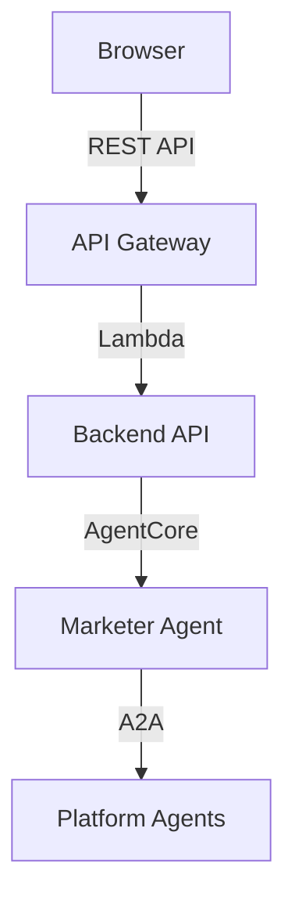

# Frontend & Deployment

## Frontend: Cloudscape Design System

The MarTech platform uses **Cloudscape Design System** — AWS's open-source design language — to provide a console-quality web experience for marketers.



### Key Frontend Technologies

| Technology | Purpose |
|-----------|---------|
| **React 19** | UI framework |
| **Vite** | Build tool and dev server |
| **TanStack Router** | Type-safe file-based routing |
| **TanStack React Query** | Server state management and caching |
| **tRPC** | End-to-end type-safe API calls |
| **Cloudscape Components** | AWS-styled UI component library |
| **Cloudscape Chat Components** | Real-time chat interface widgets |
| **Tailwind CSS 4** | Utility-first CSS framework |
| **Cognito + OIDC** | Authentication and user management |

### Chat Interface

The core user interaction is a **real-time chat** where marketers describe campaign goals in natural language. The chat component streams responses from the Marketer Agent via HTTP streaming, rendering markdown-formatted responses including structured campaign data, tables, and action buttons.

## Build & Deploy

### Monorepo Structure

The project uses **Nx** (TypeScript) and **uv** (Python) for monorepo management:

```
packages/
  web-ui/          # React frontend
  api/             # Lambda backend APIs
  infra/           # AWS CDK infrastructure
  common/
    constructs/    # Shared CDK constructs
    types/         # Shared TypeScript types
  agents/
    common/        # Shared Python agent utilities
    marketer/      # Marketer orchestrator agent
    databricks/    # Databricks agent
    clevertap/     # CleverTap agent
    talonone/      # TalonOne agent
```

### Deployment Workflow

```bash
# 1. Install dependencies
pnpm install
uv sync

# 2. Build all packages
pnpm run build:all

# 3. Deploy to AWS
pnpm exec nx deploy infra "stack-name/*"
```

The **AWS CDK** stack provisions:

| Resource | Purpose |
|----------|---------|
| Lambda functions | API handlers and MCP servers |
| AgentCore Runtime | Docker-based agent hosting |
| DynamoDB | Campaign and session data |
| S3 | Static assets and configurations |
| API Gateway | REST API endpoints |
| Cognito | User authentication |
| Bedrock | Model access |

### Local Development

After initial deployment, you can run the UI locally for fast iteration:

```bash
# Load runtime config from deployed stack
pnpm exec nx run web-ui:load:runtime-config

# Start local dev server with HMR
pnpm exec nx serve web-ui
```

## Configuration

Before deployment, configure `packages/infra/config/default.yaml`:

- `deploymentConfig.adminUser.email` — initial Cognito admin user
- `deploymentConfig.mcp.databricks.*` — Databricks workspace credentials
- `deploymentConfig.mcp.clevertap.*` — CleverTap project credentials
- `deploymentConfig.mcp.talonone.*` — TalonOne credentials

Only the integrations you use need to be configured; unconfigured ones are safely ignored.

{}
The system prompt for each agent is also configurable via SSM Parameter Store, allowing you to tune agent behavior without redeploying code. See [Strands Agents Framework]() for details.
{}
