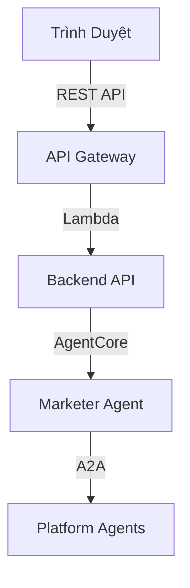

# Frontend & Triển Khai

## Frontend: Cloudscape Design System

Nền tảng MarTech sử dụng **Cloudscape Design System** — design language mã nguồn mở của AWS — để mang lại trải nghiệm web chất lượng console cho marketer.



### Công Nghệ Frontend Chính

| Công Nghệ | Mục Đích |
|-----------|---------|
| **React 19** | UI framework |
| **Vite** | Build tool và dev server |
| **TanStack Router** | Type-safe file-based routing |
| **TanStack React Query** | Server state management và caching |
| **tRPC** | End-to-end type-safe API calls |
| **Cloudscape Components** | Thư viện UI component theo phong cách AWS |
| **Cloudscape Chat Components** | Widget giao diện chat thời gian thực |
| **Tailwind CSS 4** | Utility-first CSS framework |
| **Cognito + OIDC** | Xác thực và quản lý người dùng |

### Giao Diện Chat

Tương tác chính của người dùng là **chat thời gian thực**, nơi marketer mô tả mục tiêu chiến dịch bằng ngôn ngữ tự nhiên. Chat component stream phản hồi từ Marketer Agent qua HTTP streaming, hiển thị phản hồi định dạng markdown bao gồm dữ liệu chiến dịch có cấu trúc, bảng biểu, và nút hành động.

## Build & Triển Khai

### Cấu Trúc Monorepo

Dự án sử dụng **Nx** (TypeScript) và **uv** (Python) để quản lý monorepo:

```
packages/
  web-ui/          # React frontend
  api/             # Lambda backend APIs
  infra/           # AWS CDK infrastructure
  common/
    constructs/    # Shared CDK constructs
    types/         # Shared TypeScript types
  agents/
    common/        # Shared Python agent utilities
    marketer/      # Marketer orchestrator agent
    databricks/    # Databricks agent
    clevertap/     # CleverTap agent
    talonone/      # TalonOne agent
```

### Quy Trình Triển Khai

```bash
# 1. Cài đặt dependencies
pnpm install
uv sync

# 2. Build tất cả packages
pnpm run build:all

# 3. Triển khai lên AWS
pnpm exec nx deploy infra "stack-name/*"
```

**AWS CDK** stack triển khai:

| Tài Nguyên | Mục Đích |
|----------|---------|
| Lambda functions | API handlers và MCP servers |
| AgentCore Runtime | Docker-based agent hosting |
| DynamoDB | Dữ liệu chiến dịch và phiên |
| S3 | Static assets và configurations |
| API Gateway | REST API endpoints |
| Cognito | Xác thực người dùng |
| Bedrock | Truy cập model |

### Phát Triển Local

Sau khi triển khai lần đầu, bạn có thể chạy UI locally để phát triển nhanh:

```bash
# Tải runtime config từ stack đã triển khai
pnpm exec nx run web-ui:load:runtime-config

# Chạy dev server với HMR
pnpm exec nx serve web-ui
```

## Cấu Hình

Trước khi triển khai, cấu hình `packages/infra/config/default.yaml`:

- `deploymentConfig.adminUser.email` — email admin Cognito ban đầu
- `deploymentConfig.mcp.databricks.*` — credentials Databricks workspace
- `deploymentConfig.mcp.clevertap.*` — credentials CleverTap project
- `deploymentConfig.mcp.talonone.*` — credentials TalonOne

Chỉ những integration bạn sử dụng mới cần cấu hình; những cái chưa cấu hình sẽ được bỏ qua an toàn.

{}
System prompt cho mỗi agent cũng có thể cấu hình qua SSM Parameter Store, cho phép bạn điều chỉnh hành vi agent mà không cần deploy lại code. Xem [Strands Agents Framework]() để biết chi tiết.
{}
