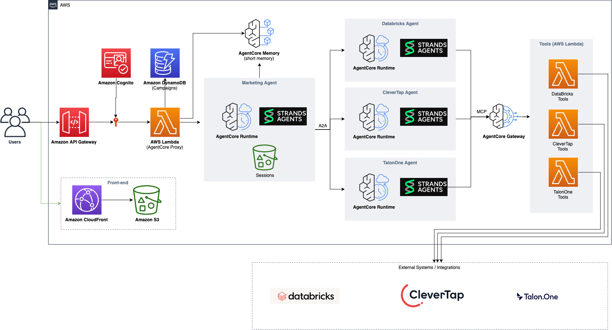

# Technical Documentation

An AI-powered marketing campaign management platform built on AWS. Users create and manage marketing campaigns through a web interface and interact with an AI agent via chat to execute marketing tasks across Databricks, CleverTap, and TalonOne.

## Architecture

## Component Documentation

- [API Handlers](./components/api-handlers.md) — Lambda functions providing REST endpoints for campaigns, chat, configuration, and SQL results
- [Marketing Agent](./components/marketing-agent.md) — Central orchestrator agent that guides users through the campaign creation workflow
- [Databricks Agent](./components/databricks-agent.md) — Worker agent for data analytics, SQL queries, and audience segmentation
- [CleverTap Agent](./components/clevertap-agent.md) — Worker agent for campaign lifecycle management
- [TalonOne Agent](./components/talonone-agent.md) — Worker agent for loyalty programs, promotions, and coupons
- [MCP Servers](./components/mcp-servers.md) — Lambda-based MCP servers behind the AgentCore Gateway
- [Infrastructure](./components/infrastructure.md) — AWS CDK stack, constructs, and deployment configuration
- [Web UI](./components/web-ui.md) — React/TypeScript frontend with [Cloudscape Design System](https://cloudscape.design/)
- [Shared Agent Utilities](./components/shared-agent-utilities.md) — Common Python utilities for A2A, gateway, and configuration
- [Session Persistence](./components/session-persistence.md) — How conversation artifacts are persisted to S3 across all agents

## Sequence Diagrams

- [Step 1 — Define Target Audience](./sequence-diagrams/sequence-step1-audience.txt)
- [Step 2 — Create Campaign](./sequence-diagrams/sequence-step2-campaign.txt)
- [Step 3 — Create Promotion (Optional)](./sequence-diagrams/sequence-step3-promotion.txt)

Sequence diagrams use [swimlanes.io](https://swimlanes.io) syntax. Paste the file contents into the editor to render them.
